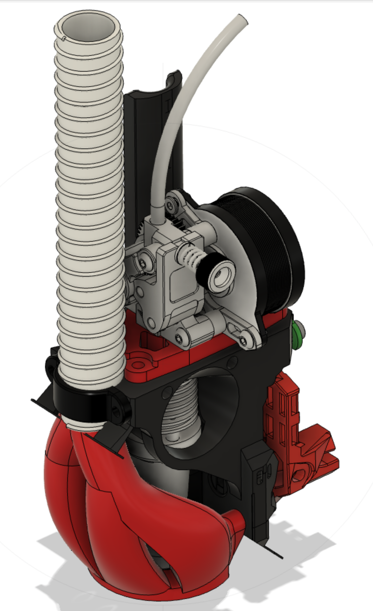

# GTap
Toolhead for Voron TAP and Goliath hotend

This custom toolhead is designed and associated parts are designed to fit Voron Tap. It uses the Goliath hotend.

All extruders, that have the same hole layout as the hextrudort, can most likely be used. For example Bondtech LGX lite, which will only make use of the front 2 holes, can also be used. 

The carriage may be printed in a orientation of your choosing, as it will require supports anyway. A preferred orientation is at a 45 degree angle. A dedicated STL file with build in support elements, which shall be cut off after printing, is available. 

